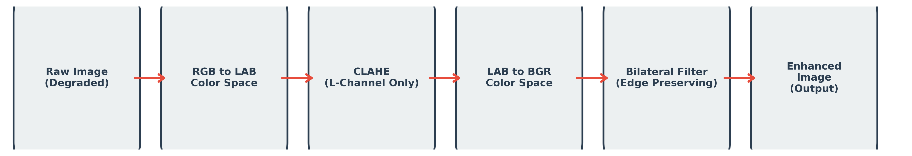
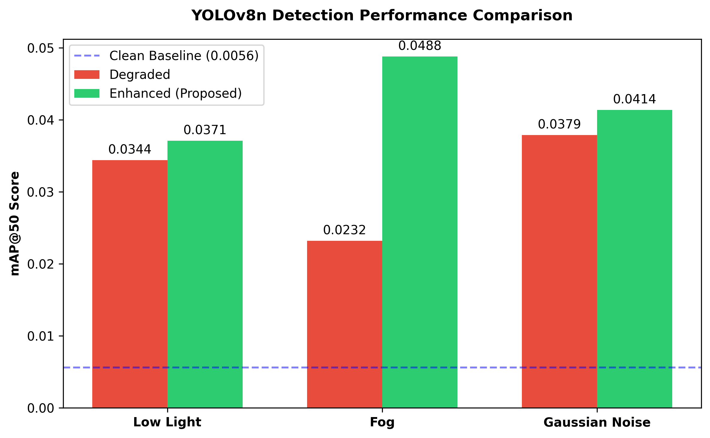
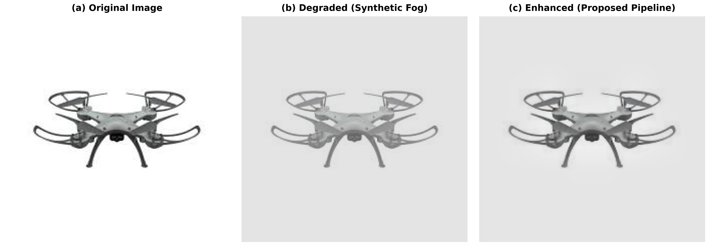
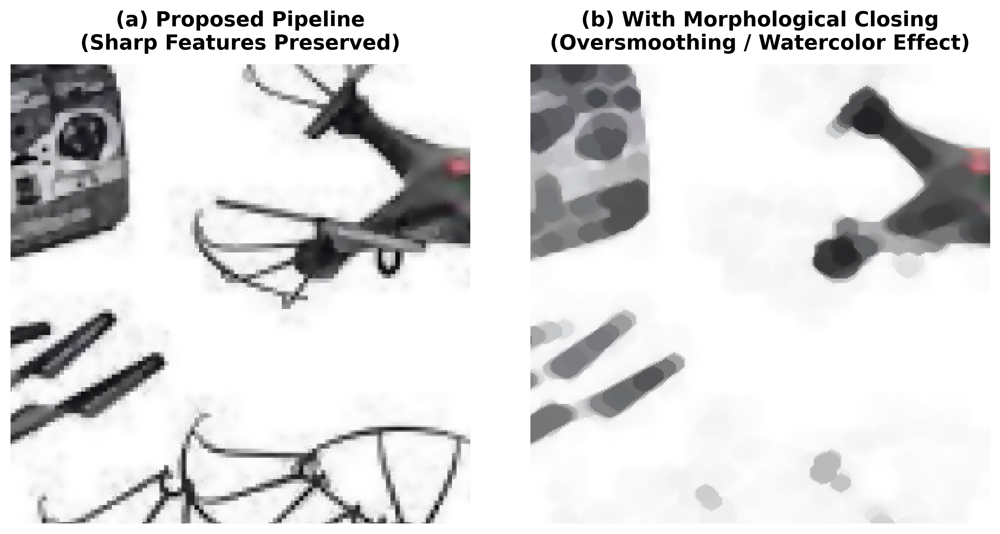

# Enhancing Real-Time UAV Detection in Adverse Visual Conditions

This repository contains the official implementation of the classical image pre-processing pipeline designed to enhance real-time Unmanned Aerial Vehicle (UAV) detection in adverse environmental conditions (e.g., dense fog, low light, and severe sensor noise). 

This project was developed as a term project. It aims to restore obscured spatial features using computationally lightweight classical algorithms, enabling off-the-shelf deep learning models (like YOLOv8) to maintain high accuracy without the need for expensive domain-specific retraining.

## 🚀 Proposed Pipeline

The pre-processing pipeline consists of three core stages:
1. **Color Space Conversion**: BGR to CIELAB (isolating the Luminance channel).
2. **CLAHE**: Applied exclusively to the L-channel to stretch dynamic contrast.
3. **Bilateral Filtering**: Edge-preserving noise suppression to maintain high-frequency structural details of UAV silhouettes.



## 📁 Repository Structure

* `generate_degradations.py`: Generates synthetic degradations (Low light, Fog, Noise) on the original dataset using OpenCV.
* `enhance_images.py`: The core implementation of the proposed enhancement pipeline (LAB + CLAHE + Bilateral).
* `calculate_metrics.py`: Calculates traditional image quality metrics (PSNR & SSIM) to evaluate pixel-level restoration.
* `evaluate_yolo.py`: Evaluates the zero-shot object detection performance (mAP@50, Precision, Recall) using a pre-trained `yolov8n.pt` model.
* `generate_figures.py`: Generates the visual figures and comparison charts used in the paper.
* `fig*.png`: Visual result figures and block diagrams.

## 🛠️ Installation & Requirements

Ensure you have Python 3.9+ installed. The following libraries are required:

```bash
pip install opencv-python numpy scikit-image ultralytics matplotlib
```

## 📊 Usage

### 1. Generate Synthetic Degradations
Run the following script to apply synthetic fog, low-light, and Gaussian noise to your dataset located in `dataset_original/`:
```bash
python generate_degradations.py
```

### 2. Run the Enhancement Pipeline
Apply the proposed enhancement pipeline to the degraded images:
```bash
python enhance_images.py
```

### 3. Calculate Image Quality Metrics
Evaluate the restoration success using PSNR and SSIM:
```bash
python calculate_metrics.py
```

### 4. Evaluate Object Detection (YOLOv8)
Measure the Mean Average Precision (mAP@50) of the zero-shot YOLOv8n model across all dataset variations:
```bash
python evaluate_yolo.py
```

## 🏆 Experimental Results

### Object Detection Performance (YOLOv8n mAP@50)
The proposed pipeline achieved significant relative performance improvements. Most notably, detection performance in **dense fog** was improved by **>100%**.



### Visual Restoration Examples


### Ablation Study: Morphological Oversmoothing
We investigated the use of wide-kernel morphological closing but excluded it from the final pipeline due to the observed "oversmoothing" effect, which eroded high-frequency spatial features critical for small target detection.



## 📄 License
This project is open-sourced for academic and educational purposes.
